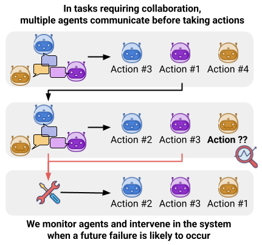
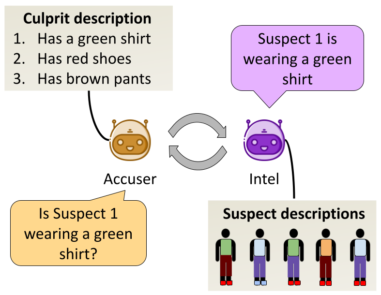
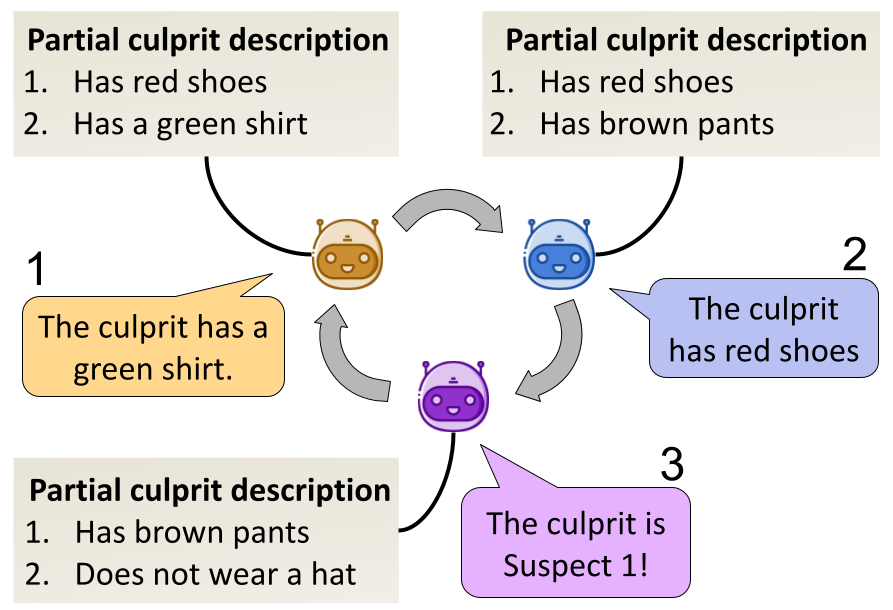

# Preventing Rogue Agents Improves Multi-Agent Collaboration

In this work, we propose to improve multi-agent collaboration through live monitoring and interventions in agent communication. 
Many failures can be detected and prevented early on — before the agent becomes non-functional and the task fails — based on the state of the agent and how it observes the environment.

To test this hypothesis, we present a monitor and intervention framework. We employ simple monitors that detect rogue agents based on intrinsic signals of uncertainty. This monitor then triggers an intervention mechanism, which prevents the communication from being distorted and the agents from failing at the task.

To evaluate our approach we also present a new multi agent collaboration environment, WhoDunitEnv.

## WhoDunitEnv: A Modular Multi-Agent Environment  

WhoDunitEnv is a modular multi-agent environment, where agents act as detectives working together to identify a culprit from a suspect lineup.  

## Game Setup  

A game consists of **$N$ suspects**, each with a unique set of attribute-value pairs that are randomly assigned from a predefined set. Attributes include:  

- **Clothing** (e.g., a green shirt)  
- **Accessories** (e.g., a silver watch)  
- **Personality Traits** (e.g., mood or interests)  

One suspect is randomly chosen as the **culprit**. Each agent receives partial information **$K_i$** about either the suspects or the culprit and must collaborate to determine the culprit and accuse them.  

Turns proceed in a **round-robin** fashion. The game ends when:  
1. An agent accuses a suspect.  
2. A turn limit is reached.  

## Actions  

Actions in the environment are represented as tuples **$(a,t)$**, where:  
- **$a \in A$** is a prime action.  
- **$t$** is the target to which the action is applied.  

## Variants  

We introduce two main variants of the environment, differing in the actions available to agents:  

**Asymmetric**           |  **Symmetric**
:-------------------------:|:-------------------------:
 |  

**Environment & Method Code coming soon!**  
